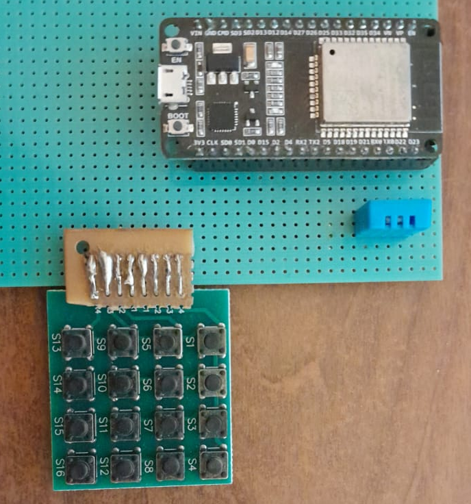

# BedCaller
Simple bed caller simulator (ESP32) that uses MQTT to publish simulated bed calls.

Microcontroller Board:  https://descubrearduino.com/esp32-modulo-esp32-wroom-gpio-pinout/

Keyboard: https://protosupplies.com/product/tactile-keypad-4x4-matrix/

The firmware use FreeRTOS: https://www.freertos.org/

The system use MQTT websocket with no auth. 


## How to compile
In order to compile the project, a file called "passwords_file.h" must be created inside ./main with the following content:

```
#ifndef PASSWORDS_H_  
#define PASSWORDS_H_

#define BROKER_URI "ws://xxxx.xxxx.xxxx.xxxx:9001"


#define EXAMPLE_ESP_WIFI_SSID      "MYNETWORK"
#define EXAMPLE_ESP_WIFI_PASS      "MYNETWORKPASS"

#endif
``` 
## Example of publication

``` 
topic : \Beds\Caller-events
message: {"callerId": 2}
```

## Interconection

<br>

<br>

[schm]